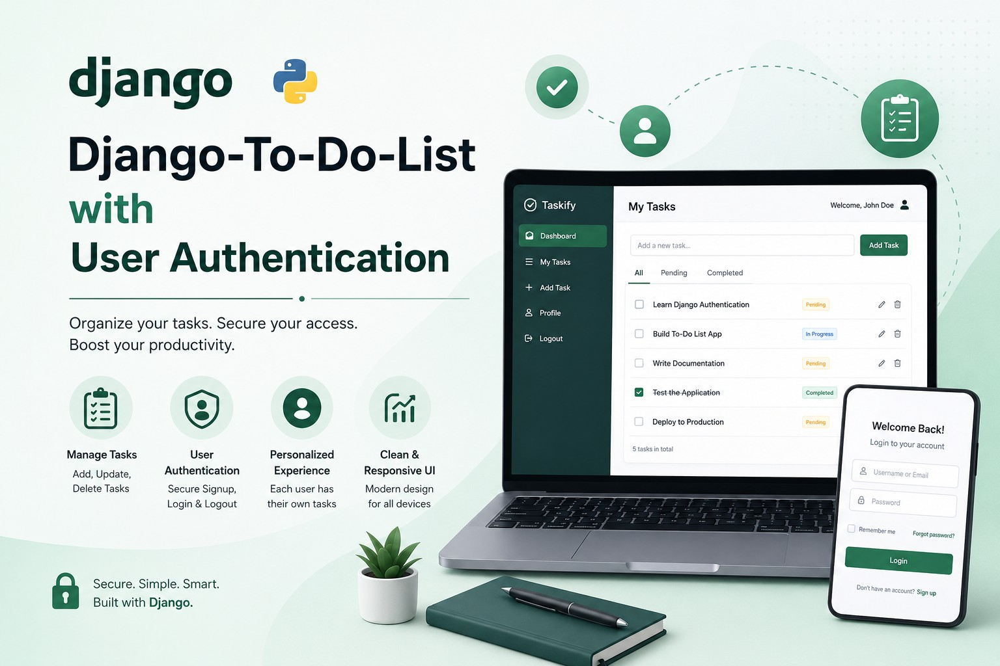
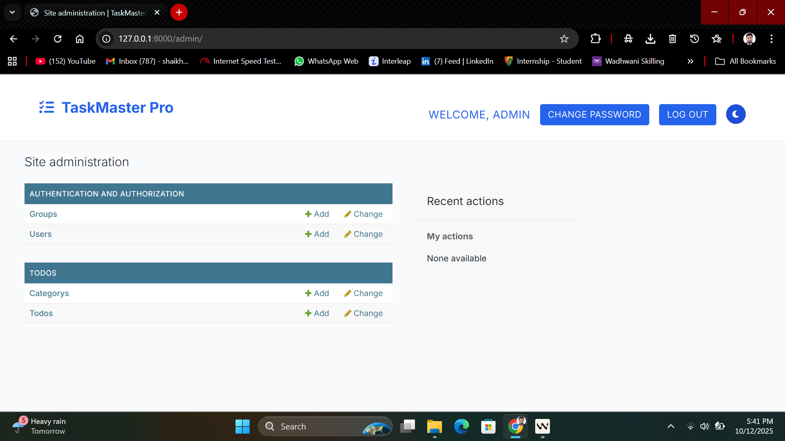
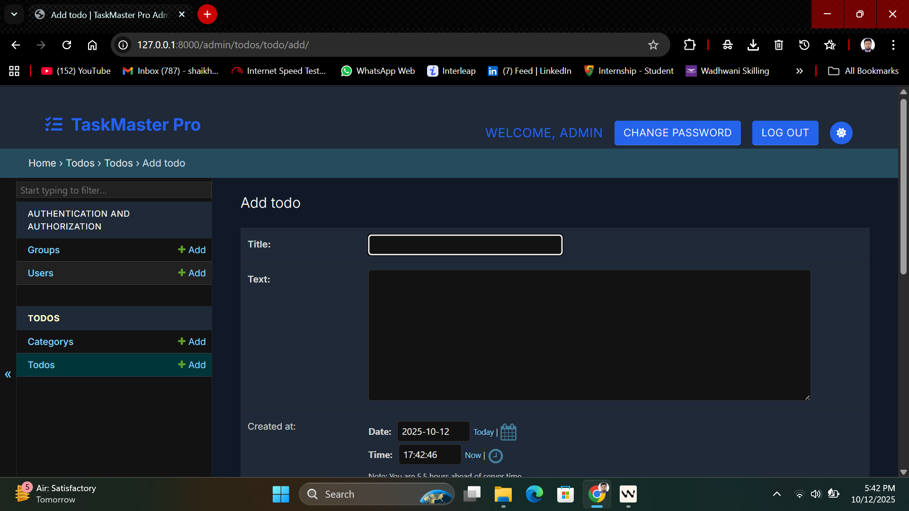
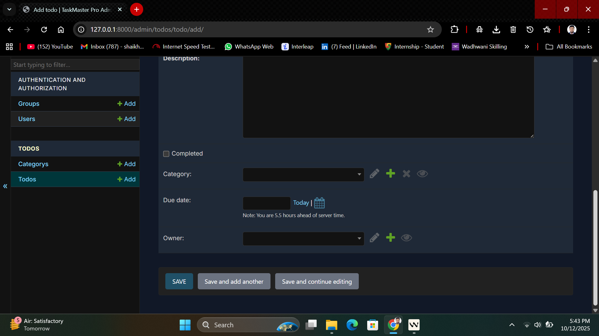
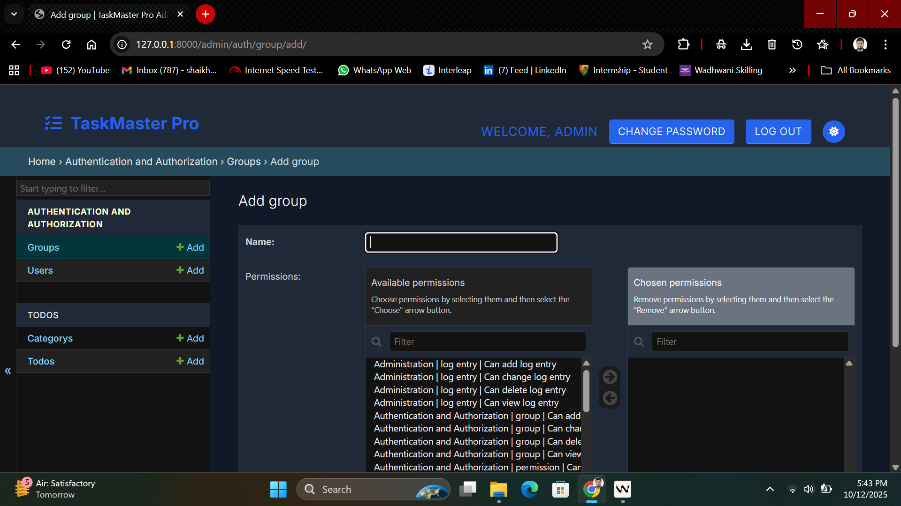
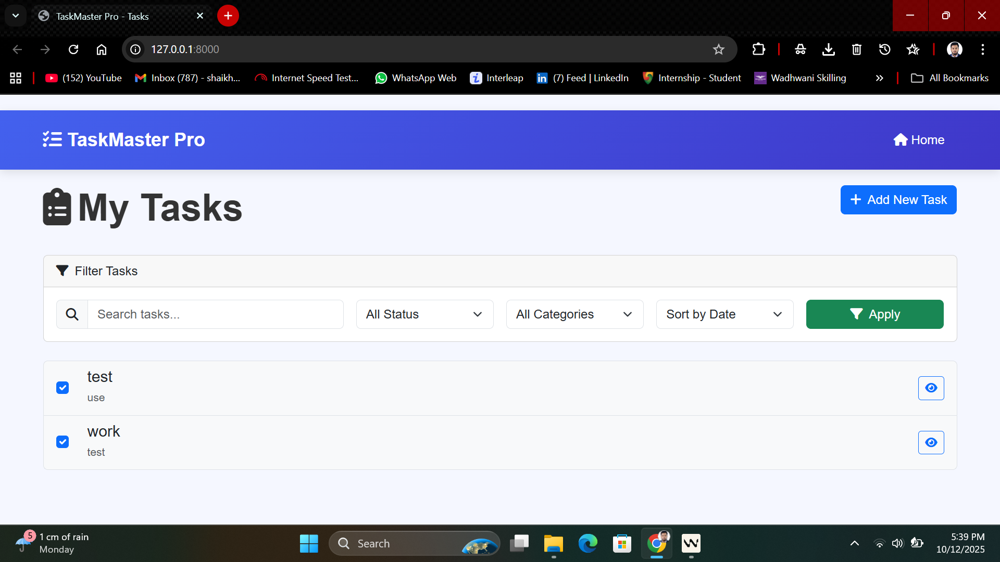
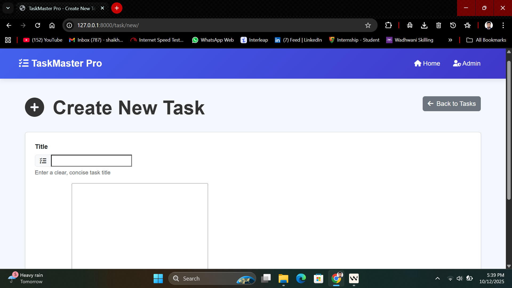
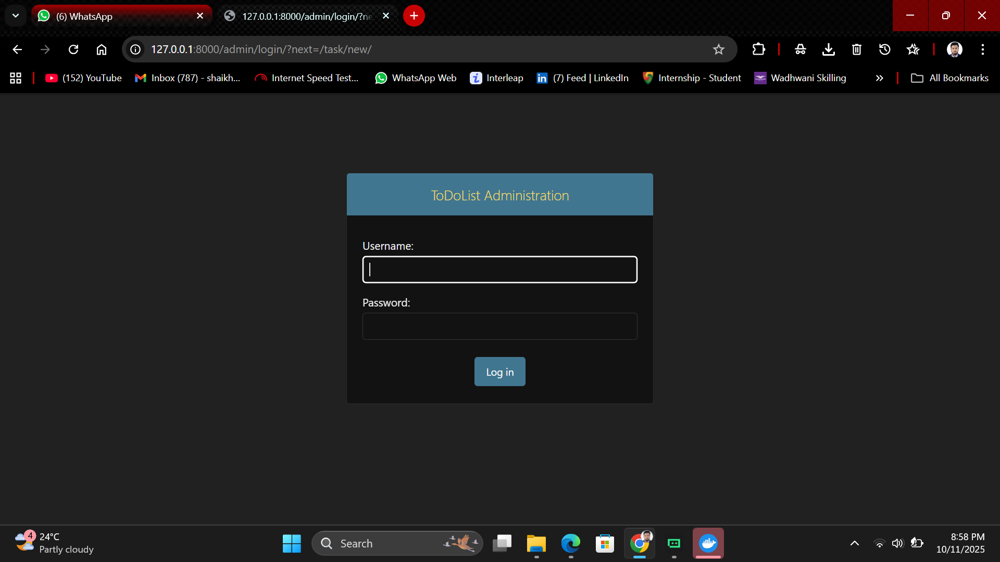
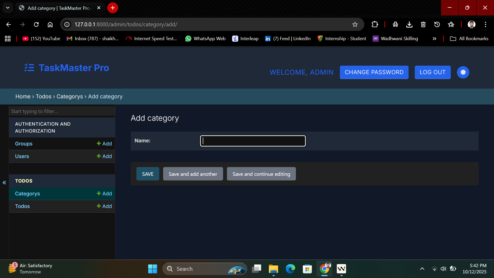

# 🚀 Django To-Do List with User Authentication

<div align="center">
  
</div>

<div align="center" style="margin-top: 20px; margin-bottom: 30px;">
  <a href="#features">Features</a> •
  <a href="#tech-stack">Tech Stack</a> •
  <a href="#getting-started">Getting Started</a> •
  <a href="#screenshots">Screenshots</a> •
  <a href="#license">License</a>
</div>

## 💡 Overview

A secure and efficient task management solution built with Django, featuring robust user authentication, task CRUD operations, and a responsive interface. This application demonstrates modern web development practices with Django, including form handling, user authentication, and database management.

## ✨ Features

- **Secure Authentication System**
  - User registration and login with email/password
  - Password reset functionality
  - Session management and security

- **Task Management**
  - Create, read, update, and delete tasks
  - Mark tasks as complete/incomplete
  - Task filtering and organization

## 📸 Screenshots

<div align="center">

### Admin Interface

#### Admin Dashboard

*Overview of the admin interface showing all manageable models*

#### Add New Task (Admin)

*Admin interface for adding new tasks*

#### Edit Task (Admin)

*Admin interface for modifying task details*

#### User Permissions

*Admin view for managing user permissions and groups*

### User Interface

#### Task List

*Main task list showing all user's tasks with completion status*

#### Create New Task

*Form for adding a new task to the list*

#### Admin Login

*Secure login interface for administrators*

#### Add Category (Admin)

*Admin interface for managing task categories*

</div>

> **Note:** All screenshots are from the actual application and reflect the current UI/UX design.
  - Secure password hashing
  - SQL injection prevention
  - XSS protection

## 🛠️ Tech Stack

- **Frontend**: HTML5, CSS3, JavaScript
- **Backend**: Django 5.0
- **Database**: SQLite (with PostgreSQL/MySQL support)
- **Authentication**: Django's built-in auth system
- **Deployment**: Docker, Kubernetes ready
- **Other Tools**:
  - WhiteNoise for static files
  - python-decouple for environment variables
  - Waitress production server

## 📋 Requirements

- Python 3.8+
- pip (Python package manager)
- MySQL/PostgreSQL (optional, SQLite is used by default)
- Docker (for containerization)

## 🚀 Getting Started

### Prerequisites

1. **Clone the repository**
   ```bash
   git clone https://github.com/Skismail57/DjangoTo-DoListwithUserAuthentication.git
   cd DjangoTo-DoListwithUserAuthentication
   ```

2. **Set up a virtual environment**
   ```bash
   python -m venv venv
   source venv/bin/activate  # On Windows: venv\Scripts\activate
   ```

3. **Install dependencies**
   ```bash
   pip install -r requirements.txt
   ```

4. **Configure environment variables**
   Create a `.env` file in the project root:
   ```
   DEBUG=True
   SECRET_KEY=your-secret-key-here
   ALLOWED_HOSTS=localhost,127.0.0.1
   ```

5. **Run migrations**
   ```bash
   python manage.py migrate
   ```

6. **Create a superuser**
   ```bash
   python manage.py createsuperuser
   ```

7. **Start the development server**
   ```bash
   python manage.py runserver
   ```

8. **Access the application**
   - Frontend: http://127.0.0.1:8000/
   - Admin Panel: http://127.0.0.1:8000/admin/

## 🏗️ Project Structure

```
DjangoTo-DoListwithUserAuthentication/
├── .github/               # GitHub workflows and templates
├── static/                # Static files (CSS, JS, images)
│   ├── css/
│   │   └── style.css
│   └── js/
├── staticfiles/           # Collected static files
├── templates/             # HTML templates
│   ├── todos/             # App-specific templates
│   │   ├── base.html
│   │   ├── task_list.html
│   │   └── task_form.html
│   └── registration/      # Authentication templates
│       ├── login.html
│       ├── signup.html
│       └── password_reset.html
├── todolist/              # Project settings
│   ├── __init__.py
│   ├── asgi.py
│   ├── settings.py
│   ├── urls.py
│   └── wsgi.py
├── todos/                 # Main app
│   ├── migrations/        # Database migrations
│   ├── static/            # App-specific static files
│   ├── templates/         # App templates
│   ├── __init__.py
│   ├── admin.py          # Admin configurations
│   ├── apps.py           # App configurations
│   ├── forms.py          # Form definitions
│   ├── models.py         # Database models
│   ├── urls.py           # URL routing
│   └── views.py          # View functions
├── .env                   # Environment variables
├── .gitignore
├── Dockerfile             # Docker configuration
├── manage.py              # Django management script
├── requirements.txt       # Python dependencies
├── docker-compose.yml     # Docker Compose configuration
└── README.md              # This file
```

## 🚀 Deployment

### Docker Deployment

1. Build and run using Docker Compose:
   ```bash
   docker-compose up --build
   ```

### Kubernetes Deployment

1. Apply Kubernetes configurations:
   ```bash
   kubectl apply -f k8s/
   ```

## 🔮 Future Enhancements

- [ ] Task categories and tags
- [ ] Task sharing between users
- [ ] Due dates and reminders
- [ ] Task priorities
- [ ] Dark mode
- [ ] REST API for mobile apps
- [ ] Real-time updates with WebSockets
- [ ] Task export (PDF, CSV)
- [ ] Calendar view for tasks
- [ ] Task comments and attachments

## 🤝 Contributing

Contributions are what make the open-source community such an amazing place to learn, inspire, and create. Any contributions you make are **greatly appreciated**.

1. Fork the Project
2. Create your Feature Branch (`git checkout -b feature/AmazingFeature`)
3. Commit your Changes (`git commit -m 'Add some AmazingFeature'`)
4. Push to the Branch (`git push origin feature/AmazingFeature`)
5. Open a Pull Request

## 📄 License

This project is licensed under the [MIT License](LICENSE) - see the [LICENSE](LICENSE) file for details.

**Copyright © 2025 K Ismail**

## 🙏 Acknowledgments

- [Django Documentation](https://docs.djangoproject.com/)
- [Bootstrap](https://getbootstrap.com/)
- [Font Awesome](https://fontawesome.com/)
- All contributors who helped in any way

---

<div align="center">
  Made with ❤️ by <a href="https://github.com/Skismail57">K Ismail</a>
</div>

---

⭐ Star this repository if you found it useful!
